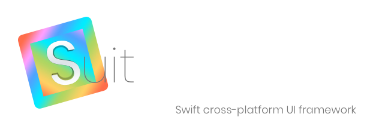

# What is Suit?
Suit is a pure Swift GUI toolkit.  It's been designed from the start to be cross-platform, and supports both macOS and Linux, today, with further platforms planned for the future, including mobile OSes.

# Why?
While in most cases it's preferable to write an app using a given platform's native toolkit, there are some cases where that's not the best choice for financial reasons, or there may be insufficient time to build a quality product on multiple platforms given the required feature set and the expected pace of development.

# Tell me more
Suit uses native font rendering on all its platforms, which provides a native-feel, especially for text-heavy applications.  The aim of Suit is to render all UI components in a way that's consistent with native components on a given platform.  In addition, some platforms will require platform-specific components, such as a ribbon component on Windows, for example.  Suit is a young project and much more work is required in this area.

For layout, Suit uses [Yoga](https://yogalayout.com) to provide a well-tested, fast, and powerful layout engine.  If you're familiar with flexbox layouts in CSS then you'll already be a pro at laying out views in Suit.

# Who is using Suit today?
Suit has primarily been developed hand-in-hand with [Stride](https://github.com/pmacro/Stride), a cross-platform IDE for Swift.  That said, while it came to life in order to make Stride a reality, it has never been developed with only Stride in mind, and as it matures the expectation is that more projects will start to use Suit.

# What is the state of Suit today?
It's been in development for more than a year at this point, and so there has been a lot of progress in major areas.  It's still its infancy, however, and is undergoing heavy development.  As such, the API is not stable and users of Suit may find they need to make frequent changes to match changes in the Suit API.  On the other hand, Suit is very usable for many cases today, and for a peek at its progress the best thing to do is check out Stride.  Everything you see is using Suit.

# How can I monitor Suit's progress

You can follow me on [Twitter](https://twitter.com/saniceadonut), where I post frequent progress updates for both Suit and Stride.  Hopefully the project will gain other contributors over time and I will no longer be a single contact point for the projects.

# Can I help?

Yes!  You most certainly can!  Please get in touch: pmacro at icloud dot com.

# Dependencies

If using Linux you will need to install some dependencies.  For convenience, you can run the install_dependencies_ubuntu.sh script located in the root of this project to install all neccessary dependencies.  If you wish to install these dependencies manually, or are not using a system with 'apt', then simply install the folllowing packages manually:

- libcairo2-dev
- libpango1.0-dev
- libxcb-util-dev

# How do I write a Suit app

The easiest way is to download Stride, create a new project, and select the "Suit App" template.  Alternatively, you can create an app outside of Stride as follows:

- Create a new executable Swift project: `swift package init --type=executable`
- Open the created Package.swift and add Suit as a dependency for your executable target.
- Update the Swift package: `swift package update`

At this point we have an executable project with Suit available for import.  Swift Package Manager will have generate a single source file under Sources/$YOUR_PROJECT_NAME/main.swift.  Next, let's create our root component and launch it from main.swift.

- Create a new file called RootComponent.swift inside Sources/$YOUR_PROJECT_NAME/.
- Paste in the following:

        import Foundation
        import Suit
    
        class RootComponent: CompositeComponent {
    
          override func viewDidLoad() {
            super.viewDidLoad()
            
            let helloWorldLabel = Label(text: "Hello, world")
            helloWorldLabel.font = .ofType(.system, category: .veryLarge)
            helloWorldLabel.width = 100%
            helloWorldLabel.height = 30~
            helloWorldLabel.horizontalArrangement = .center
            
            view.add(subview: helloWorldLabel)
            view.justifyContent = .center
          }    
        }
    
- Now open main.swift and paste in the following:

        import Foundation
        import Suit
        
        let window = Window(rootComponent: RootComponent(),
                            frame: CGRect(x: 0,
                                          y: 0,
                                          width: 800,
                                          height: 600),
                            hasTitleBar: true)
        Application.create(with: window).launch() 

Now we simply need to build and run our new app.  In order to do that we need to pass some arguments to the Swift compiler so it can find some dependencies.  To find the correct path(s) on your environment and then build, run the following from your project's root directory:

- Linux

        export YOGA_LIB_PATH=$PWD/$(find . -wholename '*/Sources/Yoga/linux*' | head -n 1)
        export CLIPBOARD_LIB_PATH=$PWD/$(find . -wholename '*/Sources/CClipboard' | head -n 1)

          swift build -Xlinker -lxcb-util -Xlinker -lxcb -Xlinker -lstdc++ -Xswiftc -L$YOGA_LIB_PATH -Xswiftc -L$CLIPBOARD_LIB_PATH

- macOS

        export YOGA_LIB_PATH=$(find . -wholename '*/Sources/Yoga/darwin*' | head -n 1)
        swift build -Xswiftc "-target" -Xswiftc "x86_64-apple-macos10.13" -Xlinker -lc++ -Xswiftc -L$YOGA_LIB_PATH

All that's left to do is run:

    swift run --skip-build
        
        
